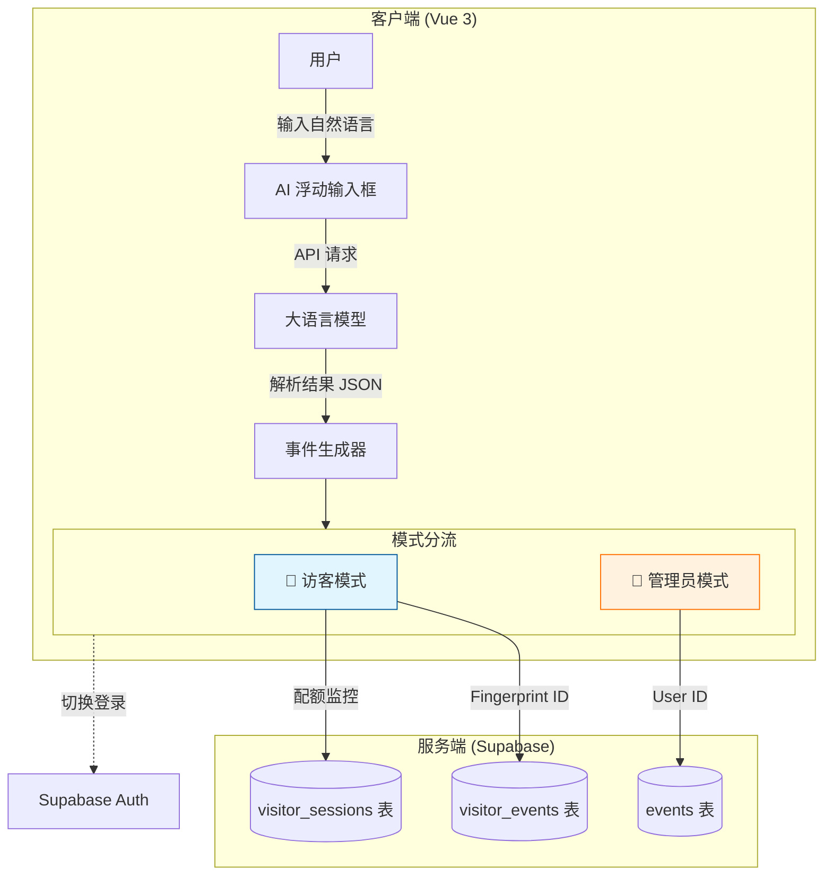

<div align="center">
  
  <h1>CalenParse (智能日历解析)</h1>
  <p>基于 Vue 3 + AI 大模型的智能倒计时与日程管理系统</p>
  <p>
    
    
    
    
    
    
  </p>
</div>

> 🏆 **核心理念**：让日程创建像聊天一样简单
>
> 🎯 **CalenParse 是什么？**
>
> **它是你的“AI 智能日程助理” —— 专为高效时间管理设计。**
>
> **它能帮你做什么？**
> 1.  **AI 语义解析**：输入“下周三下午三点开会”，自动识别时间、地点、主题，**告别繁琐的表单填写**。
> 2.  **双模式无缝体验**：
>     *   **访客模式**：无需注册，基于浏览器指纹即刻使用，免费体验 AI 解析。
>     *   **管理员模式**：解锁完整权限，云端同步，多设备无缝流转。
> 3.  **多维视图管理**：日历、列表、统计图表，全方位掌控你的时间。
> 4.  **智能倒计时**：不仅仅是日历，更是你的“时间焦虑缓解器”，实时显示重要事件倒计时。

---

## 📱 核心功能预览

|                      **日历视图**                      |                        **列表管理**                        |                        **事件详情**                        |
| :----------------------------------------------------: | :--------------------------------------------------------: | :--------------------------------------------------------: |
|  |  |  |

|                        **标签系统**                        |                        **主题定制**                        |                         **分享导出**                         |
| :--------------------------------------------------------: | :--------------------------------------------------------: | :----------------------------------------------------------: |
|  |  |  |

---

## 📖 1. 项目背景与设计思路

### 1.1 痛点分析

在日常生活中，我们经常收到碎片化的日程信息（如聊天记录、邮件通知）。将这些信息录入到日历应用中通常需要：打开应用 -> 选择日期 -> 选择时间 -> 填写标题 -> 填写地点 -> 设置提醒。**步骤繁琐，中断感强**。

此外，大多数日历应用要么强制注册（门槛高），要么纯本地存储（无法跨设备）。

### 1.2 核心设计理念

本项目致力于打造**“零摩擦”**的日程录入体验：

*   **AI First**：利用大语言模型（LLM）的自然语言处理能力，实现“一键解析，自动填单”。
*   **渐进式账户体系**：
    *   **指纹识别**：访客无需登录，利用 `FingerprintJS` 生成唯一标识，数据存云端但不绑定身份，即用即走。
    *   **平滑升级**：需要长期保存或多端同步时，可随时升级为管理员账户。

---

## 🛠️ 2. 技术栈概览

本项目采用现代化的前端技术栈，结合 Serverless 后端服务。

### 2.1 核心框架

*   **前端框架**: Vue 3 (Composition API) + Vite
*   **语言**: TypeScript (Strict Mode)
*   **UI 组件库**: Element Plus (定制化主题)
*   **日历引擎**: FullCalendar (DayGrid, TimeGrid, MultiMonth)
*   **数据可视化**: Chart.js + Vue-Chartjs

### 2.2 数据与服务

*   **云数据库**: Supabase (PostgreSQL) - 实时数据同步
*   **身份认证**: Supabase Auth + FingerprintJS (无感认证)
*   **AI 引擎**: OpenAI 接口标准 (支持 GLM-4/GPT-4o 等)
*   **工具库**:
    *   `Day.js`: 强大的日期处理
    *   `Pinia`: 状态管理
    *   `html2canvas`: DOM 转图片分享

---

## 🏗️ 3. 系统架构：双轨制数据流

为了兼顾“隐私便利”与“功能完整”，本项目设计了独特的**双轨制（Dual-Track）**数据架构。



### 3.1 访客轨道 (Visitor Track)
*   **机制**：使用浏览器指纹作为主键。
*   **配额**：每位访客拥有独立的免费 AI 解析次数（默认 1 次）和事件存储空间（默认 3 个）。
*   **生命周期**：数据保留 30 天，通过数据库 Trigger 自动清理过期数据，保持系统轻量。

### 3.2 管理员轨道 (Admin Track)
*   **机制**：基于 JWT 的标准用户认证。
*   **权限**：无限制的 AI 调用、无限事件存储。
*   **监控**：管理员拥有上帝视角，可查看 `MonitoringPage`，实时监控访客活跃度与 Token 消耗。

---

## ⚡ 4. 核心亮点详解

### 4.1 🤖 智能解析引擎
在浮动输入框中输入任意包含日程信息的文本：
> “下周五晚上7点在体育馆看演唱会，提前半小时出发”

AI 会自动提取：
*   **时间**：下周五 19:00 (自动计算具体日期)
*   **地点**：体育馆
*   **标题**：看演唱会
*   **描述**：提前半小时出发
*   **标签**：自动匹配如“娱乐”、“出行”等标签

### 4.2 ⏱️ 动态倒计时系统
*   **未来事件**：显示“还有 3 天 5 小时开始”
*   **进行中**：显示“还有 2 小时结束”
*   **历史事件**：显示“已结束 5 天”
*   **自适应单位**：根据时长自动切换 天/时/分 显示模式。

### 4.3 📅 智能模板库
针对重复性日程（如“周会”、“健身”），系统提供强大的模板功能：
*   **一键应用**：保存常用事件为模板，下次直接调用，仅需微调时间。
*   **时长预设**：自动记录事件时长，创建时自动填充结束时间。
*   **标签继承**：模板关联的标签会自动应用到新事件。

### 4.4 🔍 组合式搜索与筛选
超越简单的关键词匹配，提供多维度筛选能力：
*   **组合筛选**：支持 `关键词` + `日期范围`（今天/本周/本月）+ `地点` + `标签` 的交集筛选。
*   **智能联想**：自动提取现有事件中的所有地点和标签供选择。
*   **实时反馈**：筛选结果实时更新，并显示匹配数量。

### 4.5 📊 批量管理与统计
*   **批量操作**（仅管理员）：
    *   在列表视图中多选事件。
    *   **批量编辑**：统一修改地点或描述信息。
    *   **批量删除**：一键清理过期或错误数据。
*   **可视化统计**：
    *   **时间分布**：按日/周/月查看事件密度。
    *   **动态图表**：图表颜色随系统主题（深色/浅色）自动适配。

### 4.6 🔄 数据自由流转
*   **导入导出**：支持标准 `.ics` (iCal) 和 `.json` 格式。
*   **冲突策略**：导入时可选择 `跳过`、`覆盖` 或 `保留副本`，确保数据安全。
*   **选择性导出**：支持导出全部数据或仅导出选中的特定事件。

---

## 🚀 5. 快速开始

### 前置要求
*   Node.js >= 16.x
*   Supabase 账号（免费版即可）
*   LLM API Key (推荐智谱 AI 或 OpenAI)

### 5.1 安装与运行

1.  **克隆项目**
    ```bash
    git clone https://github.com/your-username/calenparse.git
    cd calenparse
    ```

2.  **安装依赖**
    ```bash
    npm install
    ```

3.  **配置环境变量**
    复制 `.env.example` 为 `.env` 并填入配置：
    ```env
    VITE_SUPABASE_URL=https://your-project.supabase.co
    VITE_SUPABASE_ANON_KEY=your_supabase_anon_key
    VITE_LLM_API_KEY=your_llm_api_key
    ```

4.  **数据库初始化**
    在 Supabase SQL Editor 中执行 `supabase-init.sql` 脚本，创建表结构与安全策略 (RLS)。

5.  **启动开发服**
    ```bash
    npm run dev
    ```

---

## 📂 6. 项目结构

```
calenparse/
├── src/
│   ├── components/          # 业务组件 (PascalCase)
│   │   ├── CalendarView.vue      # 全功能日历视图
│   │   ├── FloatingInput.vue     # AI 输入核心组件
│   │   ├── BatchOperationBar.vue # 批量操作栏
│   │   ├── StatisticsView.vue    # 统计分析图表
│   │   ├── TemplateManager.vue   # 模板管理
│   │   └── MonitoringPage.vue    # 管理员监控看板
│   ├── composables/         # 组合式函数 (Hooks)
│   │   ├── useLLM.ts             # AI 接口封装
│   │   ├── useAuth.ts            # 权限管理
│   │   ├── useSearch.ts          # 搜索逻辑
│   │   └── useVisitorEvents.ts   # 访客数据逻辑
│   ├── utils/               # 工具库
│   │   ├── date.ts               # 日期处理核心
│   │   └── import-export.ts      # iCal/JSON 转换
│   └── App.vue              # 根组件
├── supabase-init.sql        # 数据库初始化脚本
└── README.md                # 项目文档
```

---

## 🤝 贡献与协议

欢迎提交 Issue 和 Pull Request！

*   **License**: [MIT License](LICENSE)
*   **Author**: Kiro

---
