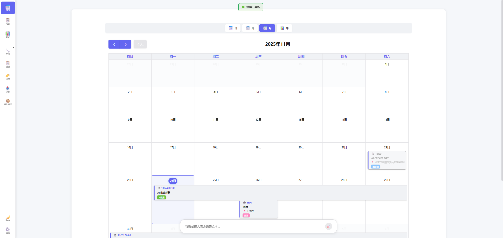
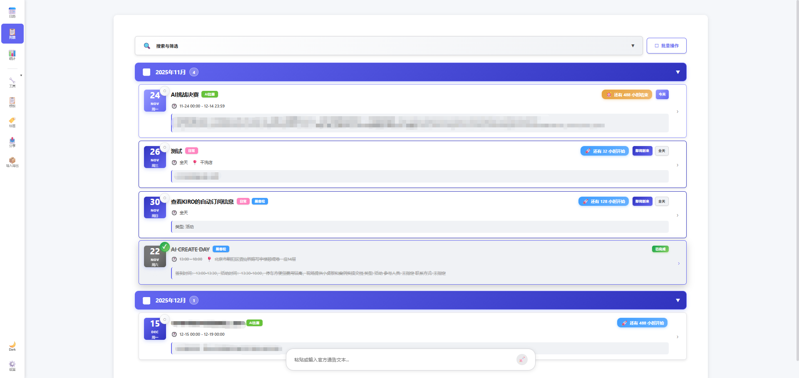
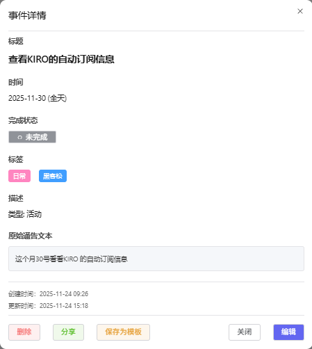
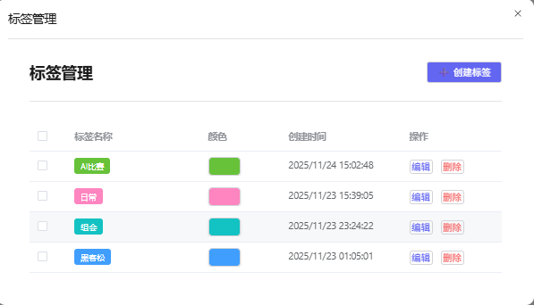
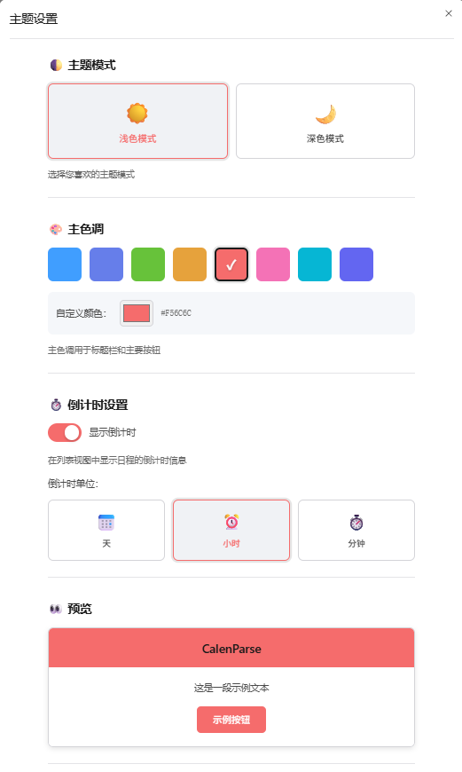
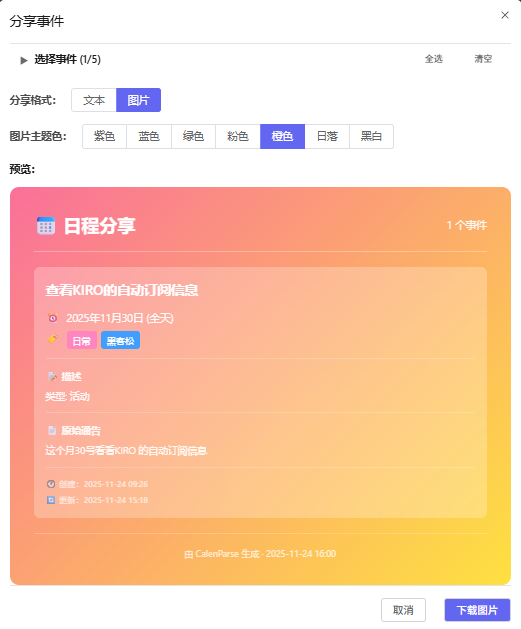

# CalenParse - 智能倒计时应用

[English](./README_EN.md) | 中文

---

## 📅 项目简介

CalenParse 是一个基于 Vue 3 + TypeScript 的现代化倒计时与事件管理应用，支持访客模式和管理员模式。通过 AI 大语言模型（LLM）自动解析文本中的日程信息，快速创建倒计时事件。访客可免费体验核心功能，管理员拥有完整权限和监控能力。数据通过 Supabase PostgreSQL 云数据库实时同步。

## 📸 应用截图

<div align="center">
  
  <p><em>主界面 - 日历视图</em></p>
</div>

<div align="center">
  
  <p><em>列表视图 - 批量管理事件</em></p>
</div>

<div align="center">
  
  <p><em>事件详情 - 编辑和管理</em></p>
</div>

<div align="center">
  
  <p><em>标签管理 - 分类组织</em></p>
</div>

<div align="center">
  
  <p><em>主题设置 - 个性化定制</em></p>
</div>

<div align="center">
  
  <p><em>分享功能 - 导出和分享</em></p>
</div>

### ✨ 核心特性

#### 双模式系统
- 👥 **访客模式** - 无需注册，基于浏览器指纹识别，免费体验核心功能
  - 1 次 LLM 智能解析配额
  - 3 个事件存储配额
  - 完整的倒计时和管理功能
- 🔐 **管理员模式** - 完整权限，无配额限制
  - 无限事件和 LLM 调用
  - 访客监控页面
  - 数据统计和分析

#### 核心功能
- 🤖 **AI 智能解析** - 输入任意文本，自动提取日程信息
- ⏱️ **倒计时显示** - 实时显示事件开始/结束倒计时，支持过去事件计数
- 📋 **多视图展示** - 日历视图、列表视图、统计分析、监控页面（管理员）
- 🏷️ **标签管理** - 为事件添加彩色标签，分类管理，支持多标签筛选
- 📝 **模板功能** - 保存常用事件为模板，快速创建新事件
- 🔍 **智能搜索** - 支持关键词、日期范围、地点、标签多维度筛选
- 📤 **导入导出** - 支持 JSON、iCal (.ics) 格式的数据导入导出
- 🎨 **主题切换** - 浅色/深色模式，自定义主题颜色，跨会话持久化
- 📱 **响应式设计** - 完美适配桌面端、平板和移动设备
- 📊 **数据统计** - 可视化展示事件分布、标签使用情况和趋势分析
- 🔄 **实时同步** - 基于 Supabase 的云端数据存储，多设备实时同步

## 🚀 快速开始

### 前置要求

- Node.js >= 16.x
- npm >= 8.x
- Supabase 账号（免费）

### 1. 克隆项目

```bash
git clone https://github.com/your-username/calenparse.git
cd calenparse
```

### 2. 安装依赖

```bash
npm install
```

### 3. 配置 Supabase 数据库

#### 3.1 创建 Supabase 项目

1. 访问 [Supabase](https://supabase.com) 并创建新项目
2. 在项目的 SQL Editor 中运行 `supabase-init.sql` 文件中的所有 SQL 语句（创建表结构和触发器）
3. 获取项目的 URL 和 anon key（在 Settings > API 中）
4. 创建管理员账号：在 Supabase Dashboard 的 Authentication > Users 中添加用户

#### 3.2 配置环境变量

1. 复制环境变量模板：
```bash
# Windows
copy .env.example .env

# macOS/Linux
cp .env.example .env
```

2. 编辑 `.env` 文件，填写以下配置：

```env
# Supabase 配置（必需）
VITE_SUPABASE_URL=https://your-project.supabase.co
VITE_SUPABASE_ANON_KEY=your_supabase_anon_key

# LLM API 配置（目前仅支持智谱GLM）
VITE_LLM_API_KEY=your_llm_api_key
VITE_LLM_API_ENDPOINT=https://open.bigmodel.cn/api/paas/v4/chat/completions
# VITE_LLM_MODEL=glm-5
```

**注意**：
- 所有环境变量必须以 `VITE_` 开头才能在前端访问
- LLM 配置是可选的，不配置仍可手动创建事件
- 不要将 `.env` 文件提交到版本控制系统

### 4. 启动开发服务器

```bash
npm run dev
```

应用将在 `http://localhost:5173` 启动。

**首次使用：**
- 应用会自动进入访客模式，使用 FingerprintJS 生成稳定的浏览器指纹
- 访客模式配额：1 次 LLM 调用 + 3 个事件存储
- 点击侧边栏底部"登录"按钮可切换到管理员模式（需要 Supabase Auth 账号）
- 访客数据会在 30 天未活跃后自动清理

### 5. 构建生产版本

```bash
npm run build
```

构建产物将输出到 `dist` 目录。

### 6. 预览生产构建

```bash
npm run preview
```

## 📁 项目结构

```
calenparse/
├── src/
│   ├── components/          # Vue 组件（PascalCase 命名）
│   │   ├── CalendarView.vue      # 日历视图（FullCalendar）
│   │   ├── ListView.vue          # 列表视图（支持批量操作）
│   │   ├── StatisticsView.vue    # 统计视图（Chart.js）
│   │   ├── MonitoringPage.vue    # 监控页面（管理员专用）
│   │   ├── EventDialog.vue       # 事件编辑对话框
│   │   ├── FloatingInput.vue     # 浮动输入框（ChatGPT 风格）
│   │   ├── PreviewDialog.vue     # LLM 解析结果预览
│   │   ├── TagManager.vue        # 标签管理
│   │   ├── TemplateManager.vue   # 模板管理
│   │   ├── ShareDialog.vue       # 分享对话框
│   │   ├── ImportExport.vue      # 导入导出
│   │   ├── ThemeSettings.vue     # 主题设置
│   │   ├── VisitorBanner.vue     # 访客配额横幅
│   │   ├── AdminLoginDialog.vue  # 管理员登录
│   │   ├── SearchBar.vue         # 搜索栏
│   │   ├── BatchOperationBar.vue # 批量操作栏
│   │   ├── BatchEditDialog.vue   # 批量编辑对话框
│   │   ├── CountdownIndicator.vue# 倒计时指示器
│   │   ├── ErrorState.vue        # 错误状态组件
│   │   └── ...                   # 其他组件
│   ├── composables/         # 组合式函数（useXxx.ts，有副作用的逻辑）
│   │   ├── useAuth.ts            # 访客/管理员认证（单例模式）
│   │   ├── useEvents.ts          # 事件管理（统一接口）
│   │   ├── useVisitorEvents.ts   # 访客事件管理
│   │   ├── useSupabase.ts        # Supabase 集成
│   │   ├── useLLM.ts             # LLM API 集成
│   │   ├── useSearch.ts          # 搜索功能
│   │   ├── useTheme.ts           # 主题管理
│   │   ├── useMonitoring.ts      # 访客监控（管理员）
│   │   ├── useTags.ts            # 标签管理
│   │   ├── useTemplates.ts       # 模板管理
│   │   └── useCountdown.ts       # 倒计时计算
│   ├── types/               # TypeScript 类型定义（集中在 index.ts）
│   │   └── index.ts              # 所有共享类型定义
│   ├── utils/               # 工具函数（纯函数，无副作用）
│   │   ├── date.ts               # 日期处理（Day.js）
│   │   ├── errorHandler.ts       # 错误处理
│   │   ├── import-export.ts      # 导入导出（JSON/iCal）
│   │   ├── animations.css        # 动画样式
│   │   ├── buttons.css           # 按钮样式
│   │   └── tags-badges.css       # 标签徽章样式
│   ├── test/                # 测试文件
│   │   ├── date.test.ts          # 日期工具测试
│   │   ├── countdown.test.ts     # 倒计时测试
│   │   └── ...                   # 其他测试
│   ├── App.vue              # 根组件（极简侧边栏布局）
│   ├── main.ts              # 应用入口
│   └── style.css            # 全局样式（CSS 变量）
├── .kiro/                   # Kiro AI 配置
│   ├── specs/                    # 功能规格文档
│   └── steering/                 # AI 指导规则
│       ├── bms.md                # 全局规则
│       ├── tech.md               # 技术栈规范
│       ├── structure.md          # 项目结构规范
│       └── product.md            # 产品规范
├── assets/                  # 应用截图
├── public/                  # 静态资源
├── dist/                    # 构建输出（自动生成）
├── supabase-init.sql        # 数据库初始化脚本
├── package.json             # 项目配置
├── vite.config.ts           # Vite 配置（路径别名 @/）
├── vitest.config.ts         # Vitest 配置
├── tsconfig.json            # TypeScript 配置（strict mode）
├── tsconfig.app.json        # 应用 TS 配置
├── tsconfig.node.json       # Node TS 配置
├── vercel.json              # Vercel 部署配置
├── .env.example             # 环境变量模板
└── README.md                # 项目文档
```

## 🎯 核心功能详解

### 1. 双模式系统

#### 访客模式
- **自动初始化**：首次访问自动生成浏览器指纹（FingerprintJS），无需注册
- **配额限制**：
  - 1 次 LLM 智能解析（用完后仍可手动创建事件）
  - 3 个事件存储（超出后需删除旧事件或升级到管理员）
- **数据隔离**：每个访客的数据独立存储在 `visitor_events` 表，基于指纹识别
- **自动清理**：30 天未活跃的访客数据会被自动清理（通过数据库触发器）
- **会话管理**：`visitor_sessions` 表记录指纹、LLM 使用次数、Token 消耗等

#### 管理员模式
- **完整权限**：无配额限制，无限事件和 LLM 调用
- **监控页面**：查看所有访客会话、LLM 使用情况、事件统计、Token 消耗
- **数据管理**：管理员事件存储在 `events` 表，与访客数据完全隔离
- **认证方式**：通过 Supabase Auth 登录，支持邮箱密码认证
- **切换模式**：可随时在访客/管理员模式间切换，数据自动切换

### 2. AI 智能解析

在浮动输入框中输入任意包含日程信息的文本，例如：

```
明天下午3点到5点在会议室A开项目评审会
下周一全天团建活动
2024年12月25日圣诞节派对
```

AI 会自动提取：
- 事件标题
- 开始/结束时间（支持相对时间和绝对时间）
- 是否全天事件
- 地点
- 描述信息
- 相关标签

**技术实现**：
- 使用 LLM API（OpenAI 格式）进行自然语言解析
- 支持多个事件同时解析
- 解析结果在预览对话框中确认后再创建
- 自动匹配已有标签，不自动创建新标签

**配额说明**：
- 访客模式：1 次免费调用（用完后仍可手动创建事件）
- 管理员模式：无限制
- Token 消耗会记录在 `visitor_sessions` 表中

### 3. 倒计时功能

- **未来事件**：显示"还有 X 天/小时/分钟开始"
- **过去事件**：显示"已过期 X 天"（count-up）
- **进行中事件**：显示"还有 X 天/小时/分钟结束"
- **自定义单位**：可在设置中选择默认显示单位（天/小时/分钟）
- **实时更新**：倒计时会实时更新，无需刷新页面
- **智能单位**：根据时间长度自动选择合适的显示单位

**技术实现**：
- 使用 Day.js 进行日期计算
- `useCountdown` composable 提供倒计时计算逻辑
- `CountdownIndicator` 组件负责显示

### 4. 多视图管理

- **日历视图** - 月视图、周视图、日视图，直观展示日程
- **列表视图** - 按时间顺序列出所有事件，支持批量操作
- **统计视图** - 图表展示事件分布、标签使用情况等
- **监控视图**（管理员）- 访客会话监控、LLM 使用统计、事件分析

### 5. 标签系统

- 创建自定义标签，支持颜色选择
- 为事件添加多个标签
- 按标签筛选和统计事件

### 6. 模板功能

- 将常用事件保存为模板
- 快速从模板创建新事件
- 管理和编辑模板库

### 7. 搜索与筛选

- 关键词搜索（标题、描述、地点）
- 日期范围筛选
- 地点筛选
- 标签筛选
- 多条件组合筛选

### 8. 导入导出

- **导出格式**：JSON、iCal (.ics)
- **导入格式**：JSON、iCal (.ics)
- 支持批量导入导出

### 9. 分享功能

- 生成事件分享图片（html2canvas）
- 导出为 iCal 文件分享
- 支持选择性分享多个事件


## 🎨 主题定制

应用支持浅色/深色模式切换，并提供主题定制功能：

1. 点击侧边栏底部的主题切换按钮
2. 在设置中自定义主题颜色
3. 主题配置会自动保存到本地

## 📱 响应式设计

- **桌面端** (>768px) - 侧边栏导航，宽敞布局
- **平板** (768px-480px) - 底部导航栏，优化触控
- **移动端** (<480px) - 紧凑布局，手势友好

### 常见问题

**Q: Supabase 连接失败？**
- 检查 `.env` 文件配置是否正确
- 确认 Supabase 项目已创建且数据库表已初始化（运行 `supabase-init.sql`）
- 查看浏览器控制台的详细错误信息

**Q: 访客模式配额用完了怎么办？**
- LLM 配额用完后，仍可手动创建事件
- 事件配额用完后，可删除旧事件或联系管理员升级
- 管理员模式无配额限制

**Q: 如何创建管理员账号？**
- 在 Supabase 项目的 Authentication > Users 中添加用户
- 或使用 Supabase CLI：`supabase auth signup --email admin@example.com --password yourpassword`

**Q: LLM 解析不工作？**
- 确认 `VITE_LLM_API_KEY` 和 `VITE_LLM_API_ENDPOINT` 已配置
- 检查 API 密钥是否有效
- 访客模式检查是否还有配额
- 查看网络请求是否成功

**Q: 如何自定义 LLM 提示词？**
- 编辑 `src/composables/useLLM.ts` 中的提示词模板

**Q: 访客数据会被清理吗？**
- 30 天未活跃的访客会话和事件会被自动清理
- 管理员可在监控页面手动清理访客数据

## 📄 许可证

[MIT License](LICENSE)

## 🤝 贡献

欢迎提交 Issue 和 Pull Request！

### 贡献指南

1. Fork 本仓库
2. 创建特性分支（`git checkout -b feature/AmazingFeature`）
3. 提交更改（`git commit -m 'Add some AmazingFeature'`）
4. 推送到分支（`git push origin feature/AmazingFeature`）
5. 开启 Pull Request